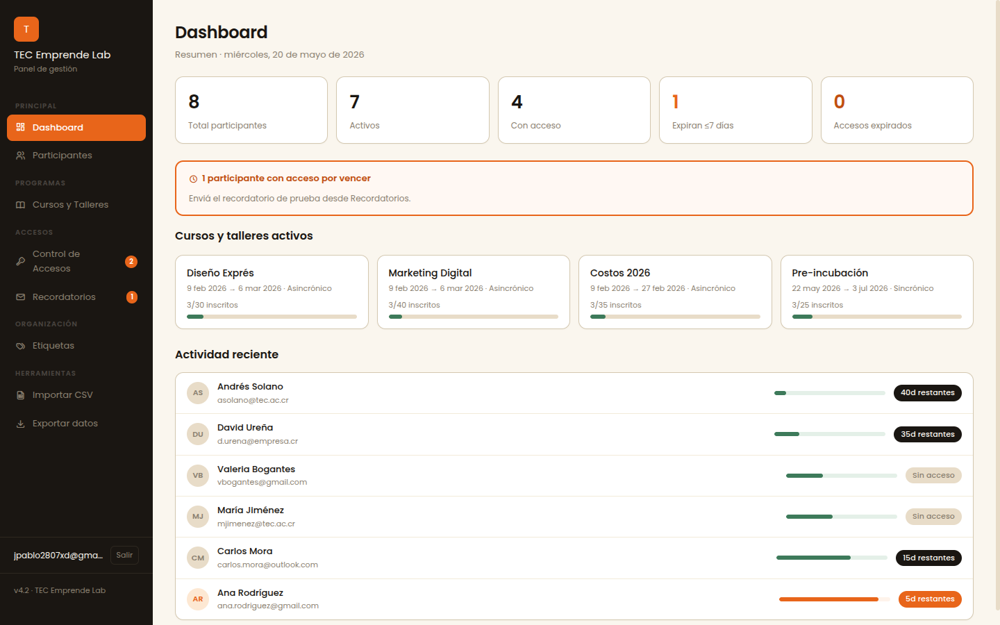
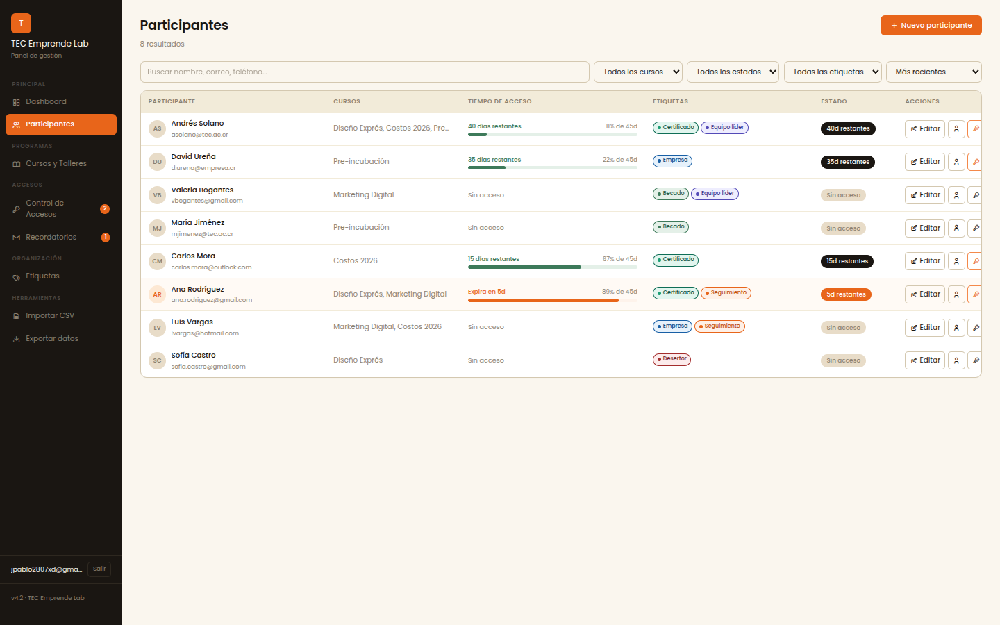

# Informe de UI para Stitch — Plataforma de Cursos · TEC Emprende Lab

Este documento describe **cada sección de la aplicación a nivel gráfico** para usarlo
como insumo en [Stitch](https://stitch.withgoogle.com) (u otra herramienta de diseño
asistido por IA). Por cada pantalla encontrarás:

1. **Propósito** — qué hace la vista.
2. **Layout actual** — cómo está compuesta hoy.
3. **Prompt para Stitch** — texto listo para pegar y pedir una propuesta de mejora.

> **Cómo usarlo:** copiá el bloque "Prompt para Stitch" de la pantalla que querés rediseñar
> y pegalo en Stitch. Empezá siempre dándole el **Sistema de diseño global** (sección 0)
> como contexto para que respete la identidad de marca. Cuando una sección tenga **captura
> de referencia**, adjuntala también en Stitch (acepta imágenes como referencia visual).

> **Capturas disponibles:** hoy existen capturas reales de **Dashboard** y **Participantes**
> (escritorio, tablet y móvil) en [`docs/screenshots/`](screenshots/). Las demás pantallas
> aún no tienen captura; ver la nota al final sobre cómo generarlas.

---

## 0. Sistema de diseño global (contexto de marca)

**Stack:** React 18 + Vite, estilos con CSS variables + utilidades Tailwind. App de escritorio
responsiva (admin dashboard), en español (es-CR).

**Paleta oficial (2.º semestre):**

| Token | Hex | Uso |
|-------|-----|-----|
| Crema fondo | `#FAF5EC` | Fondo principal de la app |
| Crema 2 | `#F2E8D0` | Filas alternas, inputs, hover |
| Crema 3 | `#E8D8B4` | Separadores, profundidad |
| Naranja | `#E8521A` | Color de marca / acción primaria |
| Naranja claro | `#F07040` | Hover, acentos |
| Siena (naranja oscuro) | `#A84020` | Alertas, expirados |
| Negro | `#1A1612` | Texto, barra lateral |
| Gris cálido | `#6E6553` | Texto secundario (contraste AA) |
| Borde | `#CEBF98` | Bordes tono arena |
| Oliva | `#6E7530` | Éxito / activo |
| Lavanda | `#8098C8` | Info / IA |

**Tipografía:** Poppins (display y cuerpo). Pesos 400–800.

**Estructura general (shell):** barra lateral fija oscura (220px) a la izquierda con logo
"T" naranja, navegación agrupada por secciones, email del usuario y botón salir al pie.
Contenido principal con fondo crema, padding generoso, tarjetas blancas con borde arena
y sombra suave (radius ~12px). En móvil la barra lateral se vuelve un drawer con botón
hamburguesa en una topbar.

**Componentes recurrentes:** `StatCard` (número grande + etiqueta), tablas estilo
`ttable` (encabezado en mayúsculas, filas alternas), `AccessBar` (barra de progreso de
días de acceso), `TimerBadge` (días restantes), `TagPill` (etiqueta de color), botones
`.btn` (naranja primario, negro, ghost) y botones de ícono redondeados.

**Estilo deseado:** limpio, cálido, profesional, accesible (WCAG AA), con buen contraste,
foco visible, y jerarquía tipográfica clara. Evitar saturación; mantener aire entre bloques.

---

## 1. Login

**Propósito:** autenticación del personal administrativo (Supabase Auth).

**Layout actual:** pantalla centrada, marca "TEC Emprende Lab", campo de correo
(placeholder `tecemprendelab@itcr.ac.cr`), campo de contraseña y botón de ingreso.

**Prompt para Stitch:**
> Diseñá una pantalla de inicio de sesión para un panel administrativo educativo del
> "TEC Emprende Lab". Centrada, fondo crema (#FAF5EC), tarjeta blanca con sombra suave.
> Logo cuadrado naranja (#E8521A) con la letra "T", título "TEC Emprende Lab", subtítulo
> "Panel de gestión". Campos: correo electrónico y contraseña, con etiquetas claras y foco
> visible. Botón primario naranja "Ingresar" a ancho completo. Tipografía Poppins. Estilo
> minimalista, cálido y accesible.

---

## 2. Dashboard

**Propósito:** resumen general del estado de participantes y cursos.

**Layout actual:** título "Dashboard" + fecha. Fila de 5 `StatCard`: Total participantes,
Activos, Con acceso, Expiran ≤7 días, Accesos expirados. Debajo, grilla de tarjetas de
cursos activos y una tarjeta con la lista de participantes recientes (avatar + nombre +
correo + `AccessBar` + `TimerBadge`).

**Captura de referencia (escritorio):**

**Móvil:** ver [`screenshots/mobile-dashboard.png`](screenshots/mobile-dashboard.png) y el
drawer de navegación [`screenshots/mobile-drawer.png`](screenshots/mobile-drawer.png).

**Prompt para Stitch:**
> Diseñá el dashboard de un panel de gestión de cursos. Encabezado con título "Dashboard"
> y fecha actual. Una fila de 5 tarjetas de métricas (número grande + etiqueta): Total
> participantes, Activos, Con acceso, "Expiran ≤7 días" (acento naranja), "Accesos
> expirados" (acento siena #A84020). Debajo, dos zonas: una grilla de tarjetas de cursos
> activos y una lista de participantes recientes con avatar, nombre, correo, una barra de
> progreso de "días de acceso" y una insignia de días restantes. Paleta crema/naranja,
> Poppins, tarjetas blancas con borde arena.

---

## 3. Participantes

**Propósito:** CRUD y gestión de participantes.

**Layout actual:** título "Participantes", botones "Verificar cédulas" y "Nuevo
participante" (naranja). Barra de búsqueda (nombre/correo/teléfono) + filtros por curso,
estado, etiqueta y orden. Tabla `ttable` con columnas: Participante, Cursos, Tiempo de
acceso (AccessBar), Etiquetas (TagPills), Estado, Acciones (editar, perfil, alternar
acceso, eliminar). Modal de creación/edición con validación accesible.

**Captura de referencia (escritorio):**

**Tablet / móvil:** ver [`screenshots/tablet-participants.png`](screenshots/tablet-participants.png),
[`screenshots/mobile-participants.png`](screenshots/mobile-participants.png) y el modal de
edición [`screenshots/mobile-modal.png`](screenshots/mobile-modal.png).

**Prompt para Stitch:**
> Diseñá una vista de tabla para administrar "Participantes" de cursos. Encabezado con
> título y dos botones a la derecha: "Verificar cédulas" (secundario) y "Nuevo participante"
> (primario naranja con ícono +). Barra de búsqueda con placeholder "Buscar nombre, correo,
> teléfono…" y chips de filtro por etiqueta. Tabla con columnas: Participante (avatar +
> nombre + correo), Cursos, Tiempo de acceso (barra de progreso), Etiquetas (pills de
> color), Estado (badge activo/inactivo) y Acciones (íconos: editar, ver perfil, acceso,
> eliminar). Filas alternas en crema. Estilo limpio, accesible, Poppins.

---

## 4. Perfil de participante

**Propósito:** detalle de un participante.

**Layout actual:** cabecera con avatar grande, nombre, estado y TagPills. Bloque de acceso
con `AccessBar` y días restantes. Sección de etiquetas editables. Sección de notas internas.
Acciones de editar.

**Prompt para Stitch:**
> Diseñá una página de perfil de un participante de cursos. Cabecera con avatar grande,
> nombre, badge de estado y etiquetas de color. Una tarjeta de "Acceso" con barra de
> progreso de días y días restantes. Sección de etiquetas con modo edición. Sección de
> "Notas internas". Botones para editar. Layout de una o dos columnas, fondo crema,
> tarjetas blancas, Poppins, accesible.

---

## 5. Cursos y Talleres

**Propósito:** gestión de cursos/talleres.

**Layout actual:** título "Cursos y Talleres", botón nuevo. Búsqueda por nombre/código.
Grilla de tarjetas de curso (nombre, código, tipo, fechas, capacidad, estado activo,
certificado habilitado).

**Prompt para Stitch:**
> Diseñá una vista de "Cursos y Talleres" en grilla de tarjetas. Encabezado con título y
> botón primario naranja "Nuevo curso". Barra de búsqueda "Buscar por nombre o código…".
> Cada tarjeta muestra: nombre del curso, código, tipo (Taller/Curso/Seminario), rango de
> fechas, capacidad, badge de estado (activo/inactivo) y un indicador de "certificado
> habilitado". Paleta crema/naranja, Poppins, accesible.

---

## 6. Control de Accesos

**Propósito:** vigencia de acceso por curso, con revocación automática al expirar.

**Layout actual:** título + subtítulo "Vigencia personalizada por curso · Revocación
automática al expirar". Fila de 4 StatCards: Activos, Pendientes, Expiran ≤7 días,
Expirados. Lista/tabla de participantes con su barra de acceso.

**Prompt para Stitch:**
> Diseñá una vista "Control de Accesos" para una plataforma de cursos. Encabezado con
> subtítulo "Vigencia personalizada por curso · Revocación automática al expirar". Fila de
> 4 tarjetas de métricas: Activos, Pendientes (acento naranja), "Expiran ≤7 días" (naranja),
> Expirados (siena). Debajo, una lista de participantes con barra de progreso de días de
> acceso y días restantes, resaltando en naranja/rojo los próximos a expirar. Estilo
> cálido crema/naranja, accesible.

---

## 7. Recordatorios

**Propósito:** participantes que deben realizar su prueba esta semana.

**Layout actual:** título + subtítulo. Lista de tarjetas de participante con la acción de
recordatorio por correo.

**Prompt para Stitch:**
> Diseñá una vista "Recordatorios" que liste participantes que deben realizar su prueba esta
> semana. Encabezado con subtítulo explicativo. Tarjetas por participante (avatar, nombre,
> curso, fecha límite) con un botón para enviar recordatorio por correo. Estado vacío
> amigable cuando no hay pendientes. Paleta crema/naranja, Poppins, accesible.

---

## 8. Etiquetas

**Propósito:** crear y administrar etiquetas con colores.

**Layout actual:** título "Etiquetas", formulario para crear (nombre + selector de color),
lista de etiquetas existentes como pills con conteo de uso y acciones.

**Prompt para Stitch:**
> Diseñá una vista "Etiquetas" para clasificar participantes. Un formulario para crear una
> etiqueta: campo de nombre (placeholder "ej. Becado, VIP, Empresa…") y un selector de color
> (paleta de swatches). Debajo, la lista de etiquetas existentes mostradas como pills de
> color, cada una con su conteo de uso y acciones (editar/eliminar). Paleta crema/naranja,
> Poppins, accesible.

---

## 9. Importar CSV

**Propósito:** importación masiva de participantes desde CSV con detección de duplicados.

**Layout actual:** título "Importar CSV", zona de carga (drag & drop), vista previa de
columnas detectadas y resumen de filas válidas/duplicadas.

**Prompt para Stitch:**
> Diseñá una vista "Importar CSV" para cargar participantes en masa. Zona de arrastrar y
> soltar prominente con ícono de subida y texto guía. Tras cargar, mostrar mapeo automático
> de columnas y un resumen de filas válidas vs. duplicadas/erróneas, con la posibilidad de
> revisar antes de confirmar. Botón primario "Importar". Estado vacío con ejemplo de formato.
> Paleta crema/naranja, accesible.

---

## 10. Exportar datos

**Propósito:** exportar reportes (Excel/CSV/PDF) por secciones.

**Layout actual:** título "Exportar datos", lista de secciones seleccionables (Resumen
ejecutivo, Cursos y talleres, Etiquetas, Alertas, Listado detallado) y tabla de vista previa.

**Prompt para Stitch:**
> Diseñá una vista "Exportar datos" de un panel educativo. Lista de bloques de reporte
> seleccionables con checkbox: "Resumen ejecutivo", "Cursos y talleres", "Etiquetas",
> "Alertas y atención requerida", "Listado detallado de participantes". Selector de formato
> (Excel / CSV / PDF). Tabla de vista previa del contenido a exportar. Botón primario
> "Exportar". Paleta crema/naranja, Poppins, accesible.

---

## 11. Certificados

**Propósito:** generación de certificados (individual y por lote) desde plantillas SVG.
Es la pantalla más compleja; ya usa un **asistente por pasos (wizard)**.

**Layout actual:**
- Encabezado "Generador de Certificados" + badges de estado ("API activa", "Claude activo").
- Dos pestañas: **Individual** y **Lote CSV**.
- **Individual (wizard 3 pasos):** ① Plantilla (carrusel de plantillas con miniaturas +
  filtro por curso + selector de participante + subir SVG) → ② Datos (mapeo de IDs + nombre,
  fecha y campos extra) → ③ Generar (resumen + formato PDF/PNG + descargar). Vista previa del
  certificado en tiempo real siempre visible a la derecha.
- **Lote CSV (wizard 3 pasos):** ① Plantilla + mapeo de IDs → ② Participantes (filtros por
  curso/estado/pago + cargar CSV + requisitos) → ③ Generar (fecha global + campos extra +
  formato + ZIP). Animación de confeti al completar.

**Prompt para Stitch:**
> Diseñá un "Generador de Certificados" para una plataforma educativa, con dos pestañas:
> "Individual" y "Lote CSV". Usá un asistente por pasos (stepper de 3 pasos en la parte
> superior: Plantilla → Datos → Generar). **Paso Plantilla:** carrusel horizontal de
> miniaturas de plantillas con flechas, un filtro por curso y un selector de participante.
> **Paso Datos:** formulario con nombre, fecha y campos adicionales detectados de la
> plantilla. **Paso Generar:** resumen de lo elegido, selector de formato (PDF/PNG) y botón
> primario "Generar y descargar". A la derecha, un panel grande de **vista previa en tiempo
> real** del certificado. En el modo "Lote", el paso de datos se reemplaza por filtros de
> participantes y carga de CSV, y el resultado muestra contadores de generados/errores con
> una celebración de confeti. Paleta crema/naranja, Poppins, accesible, jerarquía clara.

---

## 12. Galería SVG

**Propósito:** administrar plantillas de certificado (subir, etiquetar, previsualizar).

**Layout actual:** título, buscador por nombre/etiqueta, grilla de tarjetas con miniatura
del SVG, nombre y etiquetas; modal para subir nueva plantilla (nombre + etiquetas).

**Prompt para Stitch:**
> Diseñá una "Galería" de plantillas de certificado en SVG. Encabezado con título y botón
> "Subir plantilla". Buscador "Buscar por nombre o etiqueta…". Grilla de tarjetas, cada una
> con la miniatura renderizada del certificado, su nombre y etiquetas de color; al pasar el
> cursor, acciones (usar, editar, eliminar). Modal de subida con nombre (placeholder
> "Ej: Certificado Marketing 2026") y etiquetas. Paleta crema/naranja, Poppins, accesible.

---

## Notas de accesibilidad ya aplicadas (mantener en el rediseño)

- Foco visible (anillo naranja) en todos los elementos interactivos.
- Enlace "Saltar al contenido" al inicio.
- Modales con cierre por Esc, foco atrapado y restaurado.
- Errores de formulario vinculados con `aria-invalid` / `aria-describedby`.
- Navegación lateral como `<nav>` con botones reales y `aria-current`.
- Contraste de texto secundario conforme a WCAG AA.

Pedile a Stitch que **preserve estos comportamientos** y siga las pautas WCAG 2.2 AA.

---

## Capturas: estado y cómo generar las faltantes

**Ya disponibles** (en [`docs/screenshots/`](screenshots/)):

| Pantalla | Archivos |
|----------|----------|
| Dashboard | `desktop-dashboard.png`, `mobile-dashboard.png`, `mobile-drawer.png` |
| Participantes | `desktop-participants.png`, `tablet-participants.png`, `tablet-participants2.png`, `mobile-participants.png`, `mobile-modal.png` |

**Pendientes de capturar:** Login, Perfil, Cursos y Talleres, Control de Accesos,
Recordatorios, Etiquetas, Importar CSV, Exportar datos, Certificados, Galería SVG.

**Cómo generarlas** (recomendado, app desplegada en Vercel):
1. Iniciá sesión en la plataforma.
2. Entrá a cada sección y tomá captura de pantalla completa (escritorio ~1440px; opcional
   móvil ~390px).
3. Guardá los archivos en `docs/screenshots/` con nombres consistentes, p. ej.
   `desktop-courses.png`, `desktop-access.png`, `desktop-certificates.png`, etc.
4. Enlazalas en la sección correspondiente con ``.

> Avisá si querés que actualice este informe enlazando las nuevas capturas una vez tomadas.

